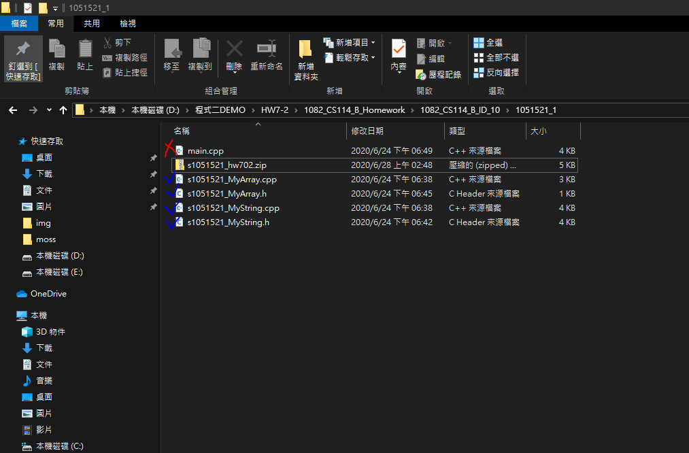
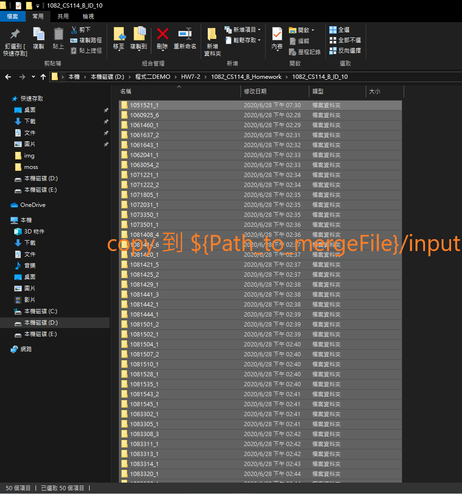
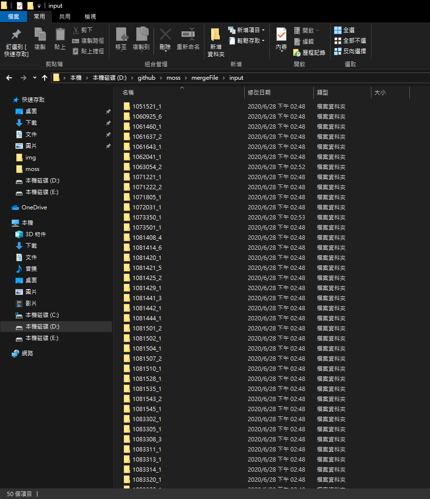
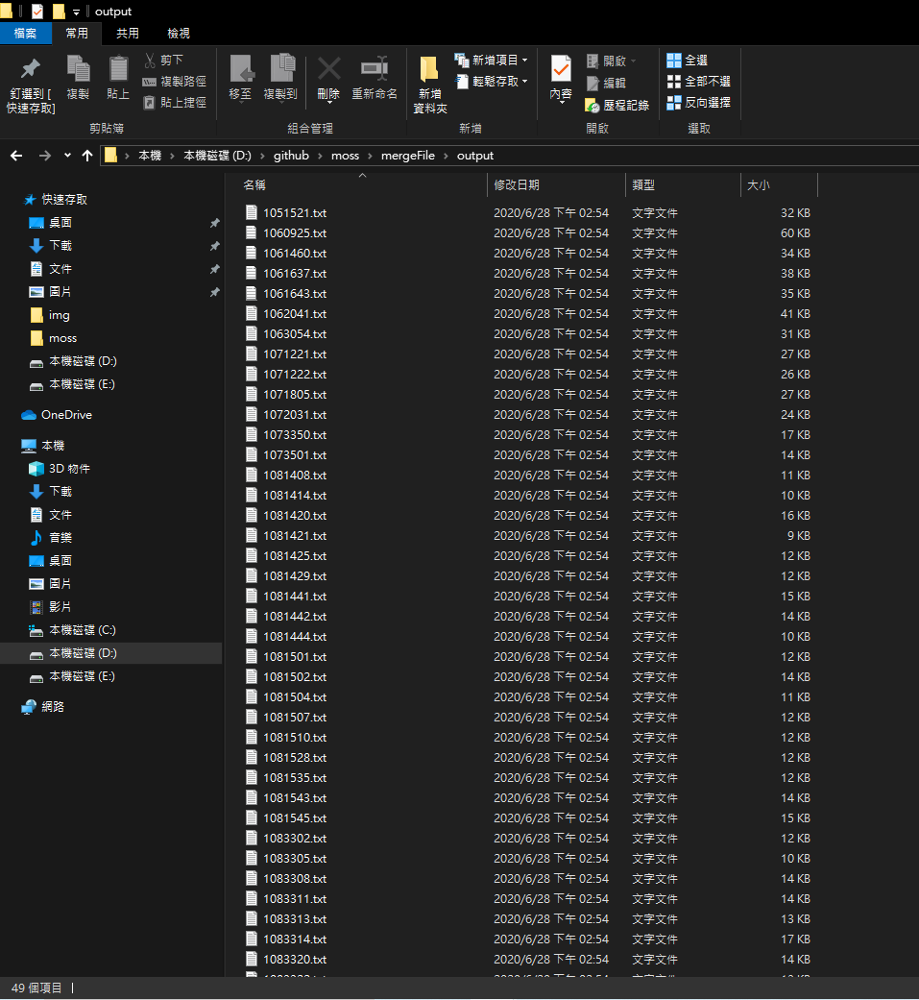

# -moss-

## Introduction
這份程式住主要來自[MOSS](http://theory.stanford.edu/~aiken/moss/)，網站中有說明如何安裝及說明，然而在此還增加了一些輔助性的程式，如合併相同學號的程式等等。

## Dependencies
|Name|
|----|
|python|
|Strawberry Perl|

## Usage Pre-processing
### 1.先將學生資料夾解壓縮

    

### 2.將每位學生需要比較的內容.h/.cpp留下(只需處理.h/.cpp、其他副檔名可忽略)

    

### 3.將每位學生需要比較的內容.h/.cpp留下(只需處理.h/.cpp、其他副檔名可忽略)

    

### 4.將所有學生處理完後，統一複製至 `${Path_to_mergeFile}/input` 裡

    
    

### 5.執行`python ${Path_to_mergeFile}/run.py`
### 6.結果會輸出在 `${Path_to_mergeFile}/output`

    

## Usage Moss
### 1.先開啟perl
在開始搜尋"perl" -> Perl(command line)

    

### 2.